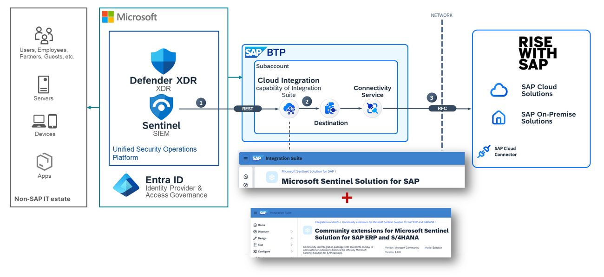

# Welcome to Sentinel Solution for SAP Community for SAP Integration Suite Recipes

Extend the official Sentinel Solution for SAP (based on agentless data connector) with the artifacts in this repository provided by the community. This project is a collection of integration artifacts or "recipes", specifically designed to help you implement your custom integration projects for Sentinel for SAP effectively.

> [!NOTE]
> This is a community driven repository; you can simply discover and consume the artifacts or even better contribute your own. Learn more [here](CONTRIBUTING.md).
>
> We are happy to feature your work in this repository.

## Available Scenarios

Find the available scenarios in the [artifacts folder](integration-artifacts/).

### Requirements

- You will need a SAP Cloud Integration tenant to consume and enhance this content. Get a free trial of SAP Integration Suite [here](https://www.sap.com/products/technology-platform/trial.html).
- You will need an SAP system fit for your integration scenario. Check out these free options:
  - SAP's [ABAP Platform Trial image](https://hub.docker.com/r/sapse/abap-cloud-developer-trial),
  - SAP S/4HANA Cloud, public cloud edition [Trial](https://www.sap.com/products/erp/s4hana/trial.html),
  - S/4HANA Fully-Activated Appliance from [SAP Cloud Appliance Library](https://cal.sap.com/), or
  - your own available in-house SAP system.
- You will need a Microsoft Sentinel workspace to consume and enhance this content. Get a free trial of Microsoft Sentinel [here](https://azure.microsoft.com/free/). Find additional details for the free trial [here](https://azure.microsoft.com/pricing/details/microsoft-sentinel/).

- You may need a SAP Cloud Connector instance deployed with line of sight to your SAP system in case of private networking. Install SAP Cloud Connector from [here](https://tools.hana.ondemand.com/#cloud) for free.

### Getting Started 🛫

1. Deploy the provided integration flows to your SAP Cloud Integration tenant:
  
    1. Download or clone the repository to your local machine
    2. Import the integration flows (zip packages) into your SAP Cloud Integration tenant using the Web UI
    3. Configure the integration flows with your SAP system and Microsoft Sentinel workspace details as needed

2. Provide feedback to the community by creating [issues](https://github.com/Azure-Samples/Sentinel-For-SAP-Community/issues) or [pull requests](https://github.com/Azure-Samples/Sentinel-For-SAP-Community/pulls)

## Contributing 👩🏼‍🤝‍👨🏽

This project welcomes contributions and suggestions. Use Pull Requests to propose changes to the content. Please see the [contribution guidelines](CONTRIBUTING.md) and the [contribution packaging guide](PACKAGING.md) for more information.

Please use [GitHub Issues](https://github.com/Azure-Samples/Sentinel-For-SAP-Community/issues) to report errors or request new features.

This project has adopted the [Microsoft Open Source Code of Conduct](https://opensource.microsoft.com/codeofconduct/). For more information see the [Code of Conduct FAQ](https://opensource.microsoft.com/codeofconduct/faq/) or contact [opencode@microsoft.com](opencode@microsoft.com) with any additional questions or comments.

## Resources

- [Microsoft Sentinel Solution for SAP | Microsoft Learn](https://learn.microsoft.com/azure/sentinel/sap/deployment-overview?tabs=agentless)
- [Microsoft Sentinel Solution for SAP BTP | Microsoft Learn](https://learn.microsoft.com/azure/sentinel/sap/sap-btp-solution-overview)
