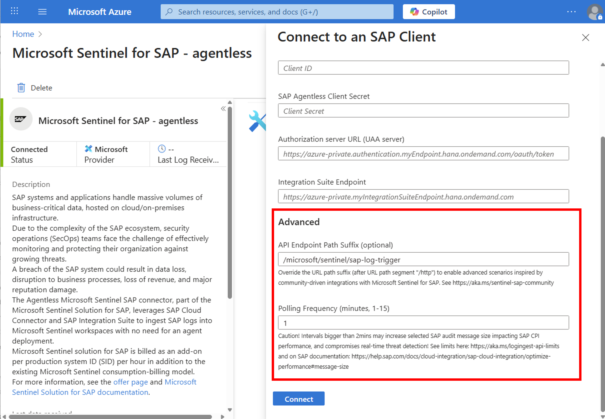

# Release Notes

| **Version** | **Date Modified (DD-MM-YYYY)** | **Comments** |
| --- | --- | --- |
| 1.0.6 | 01-12-2025 | SAP Ariba flow added |
| 1.0.5 | 23-10-2025 | SAPControl based integration flow added (AS JAVA) |
| 1.0.4 | 06-10-2025 | ClientCert auth added for S4 public edition |
| 1.0.3 | 07-08-2025 | S/4HANA Cloud Public Edition (GROW) support added |
| 1.0.2 | 30-05-2025 | SOAR - user unblock action added |
| 1.0.1 | 09-05-2025 | ABAP Table Reader scenario release |
| 1.0.0 | 17-04-2025 | SOAR for SAP scenario release |

Pick latest zip file from source or the [releases section](https://github.com/Azure-Samples/Sentinel-For-SAP-Community/releases/latest).

## Configuration hints for artifacts

### Table of Contents**

**SAP SaaS apps**

1. [SAP Ariba](#sap-ariba)
1. [SAP S/4HANA Cloud Public Edition (GROW)](#sap-s4hana-cloud-public-edition-grow)

**Supporting functions**

1. [SOAR - Configure SAP User blocking + Audit Log reactivation](#soar---sap-integration-suite-endpoint-and-rfc-destination-name)
1. [Table Reader - Custom Sentinel tables](#table-reader---custom-sentinel-tables)
1. [SAPControl based log collector (e.g. AS JAVA)](#sapctrl-log-collector)
1. [Permissions](#permissions)

### SAP Ariba

This artifact activates the existing Microsoft Sentinel Solution for SAP applications capabilities build for SAP Ariba. The integration approach relies on SAP Ariba's [Audit Search API](https://api.sap.com/api/audit_search_v2/overview).

#### Step by step

- Follow SAP's [official documentation](https://help.sap.com/docs/ariba-apis/help-for-sap-ariba-developer-portal/steps-to-start-using-sap-ariba-apis) to get started with the Ariba Audit Search API.

- Configure the iFlow "Send SAP Ariba Audit Logs to Microsoft Sentinel" the same way as described for SAP NetWeaver or private edition [here](https://learn.microsoft.com/azure/sentinel/sap/preparing-sap?pivots=connection-agentless#configure-the-connector-in-microsoft-sentinel-and-in-your-sap-system).

- Create a destination on BTP governing your connection and credential to Ariba. It is a good practice to mention the tenantid and (e.g. Ariba-p2pTeSap-2).

Take note of your destination name for the next steps on Sentinel.

##### Destination configuration example (OAuth)

| **Property** | **Value** | **Description** |
| --- | --- | --- |
| Name | Ariba-[TenantId] | Destination name (e.g., Ariba-p2pTeSap-2) |
| Type | HTTP | Connection type |
| URL | https://[region.]openapi.ariba.com/api/audit-search/v2/[prod or sandbox] | SAP Ariba Audit Search API URL (Find your base URl under [Configuration Details](https://api.sap.com/api/audit_search_v2/overview)) |
| Proxy Type | Internet | Always internet because of the cloud nature of the SAP service |
| Authentication | OAuth2ClientCredentials | For productive use |
| Client ID | [ClientId] | if applicable |
| Client Secret | [ClientSecret] | if applicable |
| Token Service URL | [TokenEndpoint]/v2/oauth/token | Ariba OAuth token endpoint |

| **Additional Properties** | **Value** | **Description** |
| --- | --- | --- |
| tenantId | [TenantId] | SAP Ariba tenant ID |
| apiKey | [apiKey] | Api key for your SAP Ariba tenant |

> [!NOTE]
> For testing purposes with API key from SAP API Business Hub you can also use pure API Key authentication as described below.
>
>| **Property** | **Value** | **Description** |
>| --- | --- | --- |
>| Name | Ariba-[TenantId] | Destination name (e.g., Ariba-p2pTeSap-2) |
>| Type | HTTP | Connection type |
>| URL | https://sandbox.api.sap.com/ariba/api/audit-search/v2/sandbox | SAP Ariba Audit Search API URL (Find your base URl under [Configuration Details](https://api.sap.com/api/audit_search_v2/overview)) |
>| Proxy Type | Internet | Always internet because of the cloud nature of the SAP service |
>| Authentication | BasicAuthentication | For use with APIKey header |
>| User | APIKey | Name of header to be sent |
>| Password | Your API Key | API Key value |

##### Finalize the setup

- Follow the steps listed [here](https://learn.microsoft.com/azure/sentinel/sap/preparing-sap?pivots=connection-agentless#configure-the-connector-in-microsoft-sentinel-and-in-your-sap-system) to finalize the SAP system onboarding on the Sentinel Solution for SAP apps using the destination name and the auth details provided by the service key of your SAP Process Integration Runtime instance. Find more details [here](https://learn.microsoft.com/azure/sentinel/sap/preparing-sap?pivots=connection-agentless#configure-sap-btp-settings).

- To use the iflow with the official connector as polling trigger supply the community path on Sentinel

  - Navigate to Advanced -> API endpoint path suffix
  - Override default with community target `/community/SAPAribaAuditSearch`.



### SAP S/4HANA Cloud Public Edition (GROW)

This artifact activates the existing Microsoft Sentinel Solution for SAP applications capabilities build for SAP NetWeaver, RISE, and S/4HANA Cloud. The integration approach relies on communication scenario [SAP_COM_0750](https://help.sap.com/docs/SAP_S4HANA_CLOUD/0f69f8fb28ac4bf48d2b57b9637e81fa/a93dca70e2ce43d19ac93e3e5531e37d.html) for audit log retrieval. Find more details on the semantic mapping [here](https://help.sap.com/docs/sap-btp-abap-environment/abap-environment/retrieving-security-audit-log-e6aa861c1f5e4baa93cba69fa0565353).

#### Step by step

- Follow SAP's [generic guide](https://learning.sap.com/learning-journeys/develop-advanced-extensions-with-sap-cloud-sdk/activating-the-apis-in-sap-s-4hana-cloud_aa10624c-4e41-42e1-b3b5-1a69c096ba5b) or [official documentation](https://help.sap.com/docs/SAP_S4HANA_CLOUD/0f69f8fb28ac4bf48d2b57b9637e81fa/2e84a10c430645a88bdbfaaa23ac9ff7.html) to activate communication scenarios and apply to `SAP_COM_0750`.

- Configure the iFlow "Send S4HANA Cloud Public Edition security logs to Microsoft Sentinel" the same way as described for SAP NetWeaver or private edition [here](https://learn.microsoft.com/azure/sentinel/sap/preparing-sap?pivots=connection-agentless#configure-the-connector-in-microsoft-sentinel-and-in-your-sap-system).

- Create a destination on BTP governing your connection and credential to S/4HANA Cloud Public Edition. It is a good practice to mention the three character SID and three digit client number (e.g. S4-PC-YKJ-100). Take note of your destination name for the next step.

##### Destination configuration example (Basic Auth)

| **Property** | **Value** | **Description** |
| --- | --- | --- |
| Name | S4-PC-[SID]-[Client] | Destination name (e.g., S4-PC-YKJ-100) |
| Type | HTTP | Connection type |
| URL | https://[tenant]**-api**.s4hana.cloud.sap | S/4HANA Cloud system **API** URL |
| Proxy Type | Internet | Always internet because of the cloud nature of the SAP service |
| Authentication | BasicAuthentication | Authentication methods supported by S/4HANA Cloud public edition |
| User | [Communication User] | if applicable |
| Password | [Password] | if applicable |

##### Destination configuration example (Client Certificate Auth)

The iflow uses the built-in client cert `sap_cloudintegrationcertificate`. You need to upload it to your S/4HANA Cloud Public Edition system and assign it to the communication user attached in arrangement `SAP_COM_0750`.

See SAP's download instructions on SAP note [2660023](https://me.sap.com/notes/2660023). Download the leaf certificate in a compatible format.

| **Property** | **Value** | **Description** |
| --- | --- | --- |
| Name | S4-PC-[SID]-[Client] | Destination name (e.g., S4-PC-YKJ-100) |
| Type | HTTP | Connection type |
| URL | https://[tenant]**-api**.s4hana.cloud.sap | S/4HANA Cloud system **API** URL |
| Proxy Type | Internet | Always internet because of the cloud nature of the SAP service |
| Authentication | ClientCertificateAuthentication | Authentication methods supported by S/4HANA Cloud public edition |
| Key Store Source | ClientProvided | this will be used as trigger for the iflow to use X509 |
| Key Store Location | (empty) | not applicable |
| Key Store Password | (empty) | not applicable |

> [!IMPORTANT]
> sap_cloudintegrationcertificate is supported out-of-the-box for ease of use. For custom Client Certificates learn more from SAP's [blog](https://community.sap.com/t5/enterprise-resource-planning-blog-posts-by-sap/beyond-basic-2-certificate-based-authentication-in-sap-s-4hana-cloud-public/ba-p/13644334) and ensure that the certificate signing authority is trusted by SAP. Find details on [SAP Note 2801396](https://me.sap.com/notes/2801396)

##### Finalize the setup

- Follow the steps listed [here](https://learn.microsoft.com/azure/sentinel/sap/preparing-sap?pivots=connection-agentless#configure-the-connector-in-microsoft-sentinel-and-in-your-sap-system) to finalize the SAP system onboarding on the Sentinel Solution for SAP apps using the destination name and the auth details provided by the service key of your SAP Process Integration Runtime instance. Find more details [here](https://learn.microsoft.com/azure/sentinel/sap/preparing-sap?pivots=connection-agentless#configure-sap-btp-settings).

- To use the iflow with the official connector as polling trigger supply the community path on Sentinel

  - Navigate to Advanced -> API endpoint path suffix
  - Override default with community target `/community/SAPS4_Public_Cloud_Security_Audit_Log`.


> [!NOTE]
> Community flows, the official agentless connector, and SAP's S/4HANA Cloud Public Edition connector in Sentinel can coexist without issues. Just ensure that the correct path is used in the connection settings.

### SOAR - SAP Integration Suite endpoint and RFC destination name

There are multiple ways to retrieve the required info for the SAP Integration Suite endpoint and the RFC destination name on SAP BTP for the Sentinel [playbook](https://learn.microsoft.com/azure/sentinel/sap/sap-solution-security-content#available-playbooks). See one inline KQL query example below.

```kql
ABAPAuditLog
| where SystemId == "PM4"
| distinct SystemUniqueId, AgentId
```

### Table Reader - Custom Sentinel tables

DCR-based custom log tables require the target schema to be defined beforehand. Find the instructions [here](https://learn.microsoft.com/azure/azure-monitor/logs/create-custom-table?tabs=azure-portal-1%2Cazure-portal-2%2Cazure-portal-3#create-a-custom-table).

- Get sample json payload for schema generation for your custom SAP table in Sentinel by executing the table reader iFlow.

- Configure the iflow using the newly created Data Collection Endpoint, immutable id of the associated data collection rule, and your custom table name (log analytics stream name). It will look something like this: "Custom-test_rfc_CL". Prefix "Custom-" and suffix "_CL" are required.

- Conclude the exercise by providing access to your data collection rule with role "Monitoring Metrics Publisher" to a service principal. See instructions and prerequisites [here](https://learn.microsoft.com/entra/identity-platform/howto-create-service-principal-portal#option-3-create-a-new-client-secret).

- Now, Run your iFlow to send data to Sentinel.

> [!NOTE]
> Log Analytics creates a TimeGenerated field if none is provided and treats all incoming values as append log stream. Meaning re-runs of the iFlow will create duplicates. Manage that by using only latest timestamp in Sentinel or altering the iFlow to do change data capture before posting.

### SAPCtrl log collector

This integration flow uses SAP Integration Suite's built-in capabilities to connect to SAPControl-based interface. It is suitable for security audit logs of AS JAVA systems, SAP ICM, or other log files accessible via SAPControl. See SAP's documentation for [Security Audit Log of the AS Java](https://help.sap.com/docs/SAP_NETWEAVER_750/1531c8a1792f45ab95a4c49ba16dc50b/4b6013583840584ae10000000a42189c.html), the official [SAP Note 221257](https://me.sap.com/notes/2212573) for reference. Consider also SAP's supportability note [3399302 ](https://me.sap.com/notes/0003399302) regarding older NetWeaver versions.

#### Destination configuration example

| **Property** | **Value** | **Description** |
| --- | --- | --- |
| Name | PO-[SID]-[Client]-SOAP | Destination name (e.g., PO-PI4-100-SOAP) |
| Type | HTTP | Connection type |
| URL | http://[virtual-hostname]:50013 | virtual host of your target SAPCtrl interface (note: https port 50014) |
| Proxy Type | OnPremise | SAP Cloud Connector routed |
| Authentication | BasicAuthentication | Authentication methods supported by S/4HANA Cloud public edition |
| User | [SAPCtrl User] | if applicable |
| Password | [Password] | if applicable |

### Permissions

| **flow** | **Relevant SAP permissions** | **Comments** |
| --- | --- | --- |
| SAP User Block from Microsoft Teams | BAPI_USER_LOCK, BAPI_USER_UNLOCK, TH_DELETE_USER | RFCs to be allowed on SAP Cloud Connector |
| SAP Table Reader | RFC_READ_TABLE | RFC Already allowed as part of official Sentinel for SAP agentless package |
| SAP AS JAVA log collector | SAPControl user | Deploy SAP's Azure Adapter for SAP Integration Suite prior |
